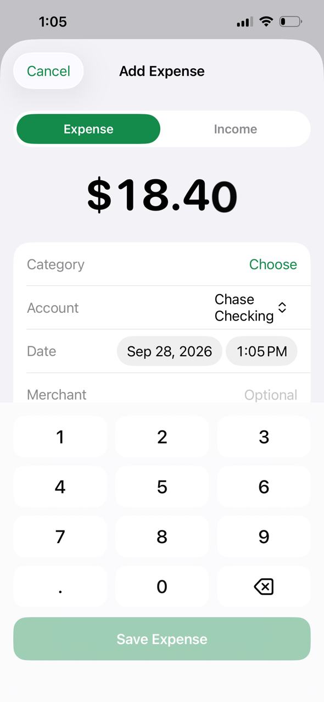
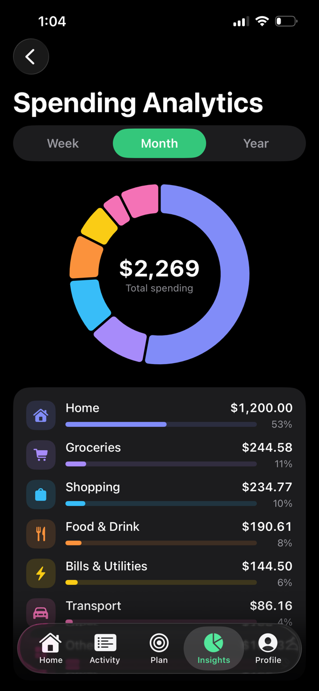
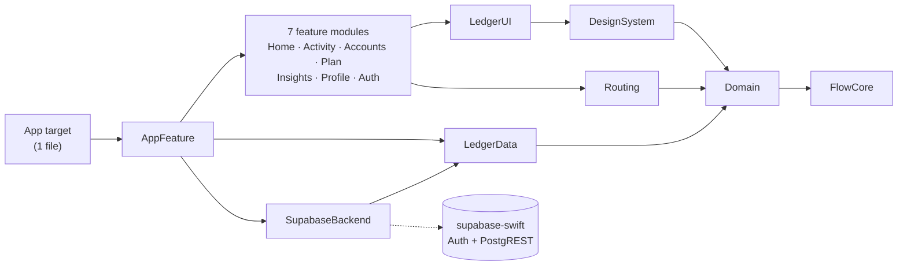

<div align="center">


# FlowMoney

**An offline-first personal finance app for iOS — built to App Store standard.**

SwiftUI · Swift 6 strict concurrency · 16 SPM modules · Supabase (Postgres + Auth + RLS) · 100+ tests on a real iPhone · CI/CD to TestFlight

[](https://github.com/devzahirul/FlowMoney-iOS/actions/workflows/ci.yml)


   

</div>

---

## For reviewers: what this repository proves

Every claim below links to the code, test or pipeline that backs it.

| Senior iOS skill | Evidence in this repo |
|---|---|
| **Architecture that scales with a team** | 16 SPM modules with compiler-enforced boundaries — features never import each other ([`Package.swift`](Packages/FlowKit/Package.swift), [ARCHITECTURE.md](docs/ARCHITECTURE.md)) |
| **Modern Swift, done correctly** | Swift 6 language mode, complete concurrency checking, **0 warnings enforced** (`-warnings-as-errors`), typed throws, `@Observable`, actors, `InternalImportsByDefault` |
| **Hard problems, not just screens** | Offline-first sync engine that survives actor re-entrancy, clock skew and concurrent devices ([`LocalLedgerRepository`](Packages/FlowKit/Sources/LedgerData/LocalLedgerRepository.swift), [ADR-0002](docs/adr/0002-offline-first-sync.md)) |
| **Test-driven, deterministic tests** | 102 swift-testing unit tests + 5 XCUITest flows, **run on a physical iPhone 13** and in CI; fixed UTC calendar and injected clocks, no `sleep()` ([`Tests/`](Packages/FlowKit/Tests)) |
| **Backend & security** | Supabase Postgres with Row Level Security on every table, proven by **14 pgTAP assertions in CI** ([`rls_test.sql`](supabase/tests/rls_test.sql)) |
| **Shipping discipline** | CI: lint · tests · release build · DB tests. Tag `v*` → versioned, cloud-signed **TestFlight** upload with dSYMs ([workflows](.github/workflows)) |
| **App Store readiness** | Privacy manifest, account deletion (5.1.1(v)), demo mode for App Review, Face ID lock, no tracking ([`PrivacyInfo.xcprivacy`](App/Resources/PrivacyInfo.xcprivacy)) |
| **Engineering judgment** | Trade-offs written down as ADRs, including what was deliberately *not* built and why ([`docs/adr`](docs/adr)) |

**By the numbers:** ~12,000 lines of product Swift · 16 modules · 1 third-party dependency · 6.2 MB stripped binary · 0 embedded frameworks · 28 screens · light + dark · Dynamic Type · VoiceOver labels.

---

## The product

A complete money manager implementing a 30-screen design ([reference](docs/design/FlowMoneyApp.png)):

- **Dashboard** — total balance with a 6-month trend, quick actions, this month's income/spending, budgets, recent activity
- **Accounts** — checking, savings, cards, loans, investments, property; balances derived from transactions
- **Transactions** — day-grouped list, diacritic-insensitive search (also by amount), filters, swipe actions, calendar heat map
- **Add expense / income** — custom keypad, category grid, merchant suggestions that also pick the category
- **Budgets** — monthly limits with *"on pace to go over"* projections, 6-month history, merchant breakdown
- **Savings goals** — progress rings, on-track projection, *"save $X a month to get there on time"*
- **Subscriptions & bills** — auto-posted on their due date, exactly once, even across several devices
- **Insights** — cash flow, spending analytics (week / month / year), monthly report, net worth over time, personalised tips
- **Notifications** — derived from the data (budget alerts, goal milestones, large transactions, renewals) plus local reminders
- **Security & data** — Face ID app lock, app-switcher privacy cover, hide-balances mode, PDF and CSV export
- **Accounts & auth** — sign up, sign in, password reset *and* email-confirmation deep links, account deletion, and a no-signup demo

> Screens 25–26 of the design (a card "wallet" with *freeze card*) were **deliberately not built**: a budgeting app that
> displays card controls it can't actually perform would mislead users and invite App Review rejection (guideline 2.3.1).

---

## Architecture

**MVVM with `@Observable` view models, a pure `Domain` layer and an offline-first repository, split into SPM modules.**



### Why this architecture, and not the alternatives

| Option | Decision |
|---|---|
| **MVVM + `@Observable`** ✅ | Apple-native Observation re-renders a view only for the properties it actually reads. View models are plain classes, tested without UI. Nothing to upgrade, nothing for the next developer to learn. |
| TCA | Great for very large teams that want one enforced pattern, but a heavy dependency with slow macro-heavy builds. Its testability is achieved here with pure functions and injected repositories. |
| VIPER | Five files per screen and a UIKit mindset; fights SwiftUI's data flow. |
| MV (no view models) | Fastest to write; business rules leak into views and can't be unit-tested. |

**How it stays fast and scalable:**

1. **All business rules are pure Swift** in `Domain` — no SwiftUI, no I/O. Budgets, projections, recurrence, net worth,
   insights and export are proven once, in milliseconds.
2. **One source of truth.** The repository streams immutable `LedgerSnapshot`s; a screen subscribes once and updates on any
   change — from another screen or another device. There is no "refresh after editing" code anywhere.
3. **Work happens off the main thread.** Snapshots and their O(1) indexes are built by the repository actor; date ranges
   use binary search; net-worth history is one backwards pass (O(n + months)); view models skip unchanged revisions.
4. **Compiler-enforced boundaries.** Features navigate with typed `Route` values and never import each other; only
   `SupabaseBackend` can see the SDK, so swapping the backend touches one module.

Decisions and trade-offs: [ADR-0001 architecture](docs/adr/0001-mvvm-observable-spm-modules.md) ·
[0002 sync](docs/adr/0002-offline-first-sync.md) · [0003 persistence](docs/adr/0003-json-snapshot-persistence.md) ·
[0004 money](docs/adr/0004-single-currency-integer-money.md) · [0005 backend](docs/adr/0005-supabase-behind-one-module.md)

---

## Engineering deep dives

The interesting part of an app like this isn't the screens — it's the problems below. Each has a test.

### 1. An offline sync engine that never loses an edit
Writes land on disk instantly and are recorded in an **outbox keyed by row**, so ten offline edits to one transaction
upload as **one** upsert. Swift actors are *re-entrant* across `await`: a user can edit a row while that row is being
pushed. The engine only clears outbox entries whose revision didn't change during the push — otherwise the newer edit
would silently vanish. → `editDuringPushSurvives()` in [`LocalLedgerRepositoryTests`](Packages/FlowKit/Tests/LedgerDataTests/LocalLedgerRepositoryTests.swift)

### 2. Not missing rows because of how Postgres timestamps work
`now()` in Postgres is the *transaction start* time, so a row can commit with an `updated_at` older than rows a client has
already pulled. Pulls re-read a 60-second window behind the cursor; merging is idempotent, so the overlap is free insurance.

### 3. Two offline phones, one row
Recurring bills are auto-posted with **deterministic UUIDs** (`UUID(namespace: rule, name: dueDate)`), and budgets get one
ID per category. Two devices working offline produce the *same* row, and the server upsert merges them — instead of
duplicating rent, or hitting a unique index that would block sync forever. → [`RecurringPoster`](Packages/FlowKit/Sources/Domain/Analytics/RecurringPoster.swift)

### 4. Exact money, and month-end dates that don't drift
Money is `Int64` minor units with banker's rounding (zero-decimal currencies like JPY included) — never `Double`.
Recurrences are computed from the start date, not chained, so *Jan 31 → Feb 28 → Mar 31* instead of drifting to the 28th.

### 5. Bugs the tests caught before users could
- Swift's synthesized `Codable` **omits `nil`** — so "restore a deleted item" (`deleted_at = null`) would never have
  reached the server. Every row now encodes explicit nulls; a test pins the exact JSON keys to the SQL columns.
- The sync status reported the wrong pending count at launch.
- Two offline devices creating the same budget would have wedged sync on a unique index.
- A pgTAP test found that Supabase's default privileges granted `DELETE` to API roles; grants are now explicit.

### 6. A launch crash that only happened from the Home Screen
Hosting the on-device unit tests in the app linked the same package modules into two binaries, so Xcode silently
switched them to dynamic frameworks without embedding them — `dyld` aborted before `main`. Diagnosed from the device
crash report, fixed at the root with a separate empty test-host app, so the app links statically exactly as it ships.

---

## Backend & security

[`supabase/`](supabase) holds the schema, the tests and a 5-minute setup guide.

- **Own `flowmoney` Postgres schema** — the app runs side by side with another app in one Supabase project with zero
  collisions; the shared sign-up trigger is exception-safe so FlowMoney can never block the other app's sign-ups.
- **Row Level Security on every table.** `user_id` defaults to `auth.uid()` and is immutable; **composite foreign keys**
  `(account_id, user_id)` stop a user attaching data to someone else's account even with a guessed ID.
- Anonymous clients get nothing; signed-in users get `select/insert/update` only — deletes are soft, and
  `delete_my_account()` removes the user's data server-side.
- Money is `bigint` with `CHECK` constraints mirroring client validation; `updated_at` is server-stamped.
- Sessions in the **Keychain** (PKCE flow); only the publishable key ships; local data encrypted at rest with
  Data Protection; sign-out wipes the local ledger and device preferences.
- Email links (`flowmoney://auth/confirm`, `flowmoney://auth/reset`) exchange a one-time PKCE code for a session and
  route password resets to an in-app *Set new password* screen.

---

## Testing

```
✔ Test run with 102 tests in 31 suites passed          swift-testing · iPhone 13 · iOS 26.7
✔ FlowMoneyUITests — 5 critical paths passed           XCUITest · same device
✔ supabase test db — 14 RLS assertions passed          pgTAP · CI
```

| Layer | What's covered |
|---|---|
| Domain | money rounding, budgets & projections, cash flow, net-worth history, goal math, month-end recurrence, insights, alerts, search, CSV escaping & formula-injection defence |
| Sync engine | offline coalescing, edit during push, remote deletes, conflict resolution, relaunch from disk, expired session |
| Backend | JSON keys ↔ SQL columns, PostgREST microsecond timestamps, unknown enums degrade gracefully, error mapping |
| View models & shell | auth flows, keypad editor, budget suggestions, session state machine, app lock, deep links, reminder planning |
| UI | demo onboarding, add expense end-to-end, form validation, every tab, sign-out |
| Database | users can't read, change, delete or reference each other's rows; constraints hold |

App Store screenshots are produced by a UI test (`ScreenshotTests`) on the device, so they always match the build.

---

## CI/CD

| Workflow | Runs |
|---|---|
| [`ci.yml`](.github/workflows/ci.yml) — every push & PR | SwiftLint `--strict` + SwiftFormat · unit + UI tests · Release build (warnings = errors) · Postgres migrations + pgTAP |
| [`release.yml`](.github/workflows/release.yml) — tag `v1.2.3` | version from the tag, build number from the run, cloud-managed signing, archive, **upload to TestFlight**, dSYMs kept |

## App Store readiness checklist

- [x] Privacy manifest with required-reason APIs and collected-data declarations
- [x] In-app account deletion · sign-out wipes local data
- [x] Demo mode, so App Review can use every feature without an account
- [x] Face ID lock, app-switcher privacy cover, Keychain sessions, encrypted local storage
- [x] Dark mode, Dynamic Type, VoiceOver labels, 44 pt targets, haptics
- [x] 1024 px opaque app icon, launch screen, portrait iPhone, `ITSAppUsesNonExemptEncryption = NO`
- [x] Automated TestFlight pipeline with symbol upload

## Known limitations & next steps

Honest scope notes (details in the ADRs): single-currency ledger (changing currency re-labels, not converts) ·
row-level last-writer-wins (no field-level merge) · tombstone purge job not yet scheduled · English only (string
catalogs are the next step) · JSON snapshot store sized for personal ledgers — the `LedgerPersistence` protocol is the
seam for moving to SQLite beyond ~20k rows.

---

## Run it

```bash
make bootstrap   # xcodegen, swiftlint, swiftformat, xcbeautify
make run         # build, install and launch on the connected iPhone
make test        # 102 unit + 5 UI tests on the connected iPhone
```

Works immediately in **demo mode** with no backend. For cloud sync, follow [`supabase/README.md`](supabase/README.md) and
copy `Config/Supabase.local.example.xcconfig` → `Config/Supabase.local.xcconfig`.

```
App/                  1 Swift file (@main) + assets + privacy manifest
Packages/FlowKit/     all product code: 16 modules + tests
TestHost/             empty app that hosts unit tests on a device
supabase/             schema migration, pgTAP tests, local config
docs/                 architecture, ADRs, screenshots, design reference
.github/workflows/    CI + TestFlight release
```

---

<div align="center">

Built by **Thomas Zahirul** — senior iOS engineer · Swift · SwiftUI · Supabase / Firebase · CI/CD.
**Available for work on Upwork.** Have a design, a slow screen or a sync problem? I'd be glad to help.

</div>
