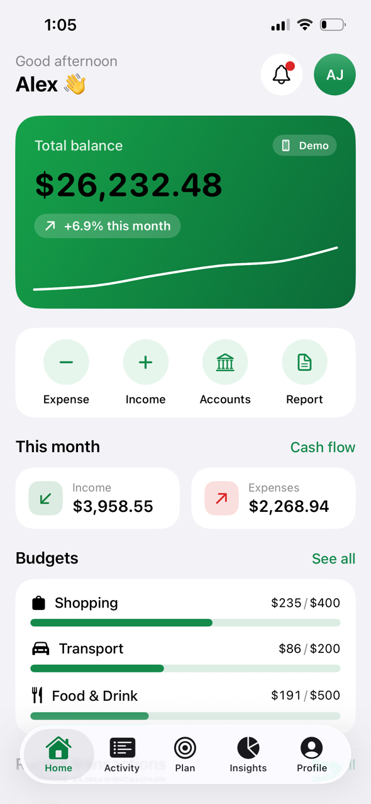
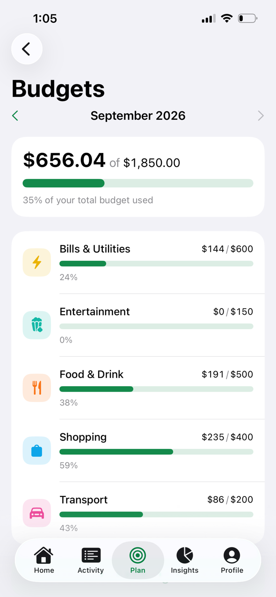
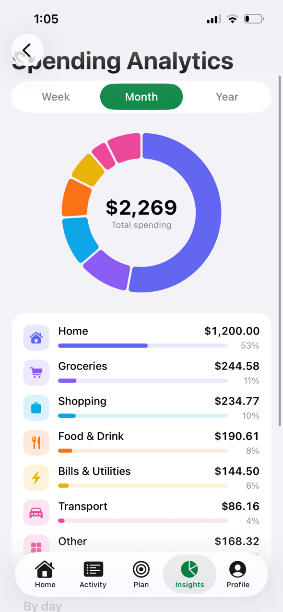
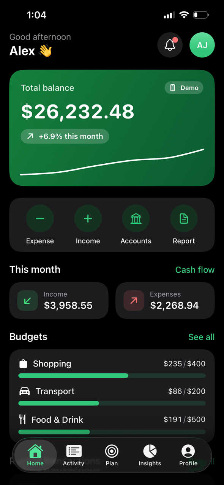
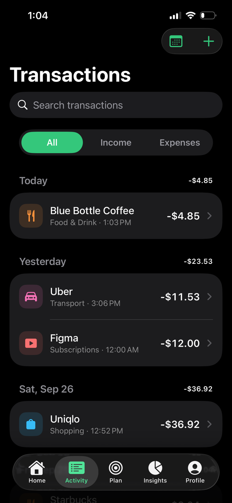
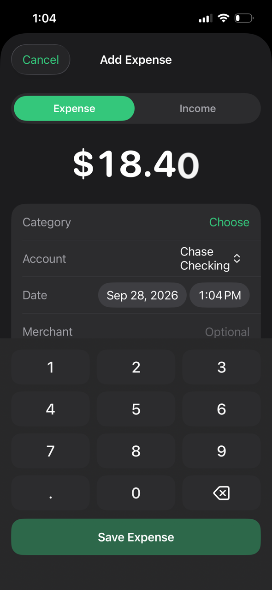
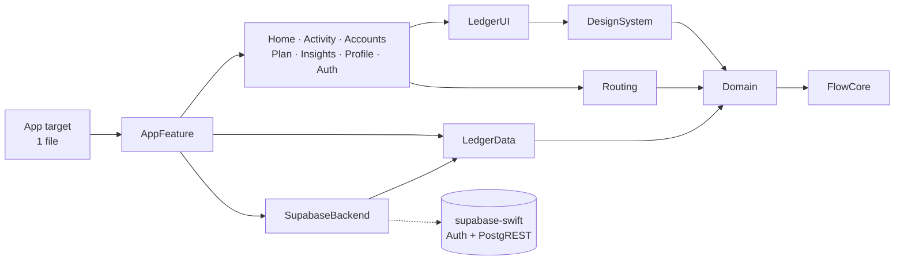

# FlowMoney — Personal Finance for iOS

**Track · Plan · Save · Grow.** A production-grade personal finance app built with SwiftUI, Swift 6 and Supabase:
accounts, transactions, budgets, savings goals, subscriptions, cash-flow and net-worth analytics, insights,
reminders, Face ID lock and PDF/CSV export — offline-first, synced across devices.

| Light | Dark |
|---|---|
|    |    |

Screenshots are produced by a UI test (`ScreenshotTests`) on a real iPhone 13, so they always show the current build.
More in [`docs/screenshots`](docs/screenshots).

---

## At a glance

| | |
|---|---|
| **Stack** | Swift 6 (strict concurrency, 0 warnings), SwiftUI, Observation (`@Observable`), Swift Charts, swift-testing |
| **Architecture** | MVVM + unidirectional data flow, 16 SPM modules, pure `Domain` layer, offline-first repository ([why](#why-this-architecture)) |
| **Backend** | Supabase (Postgres + Auth), Row Level Security on every table, pgTAP tests for the policies |
| **Tests** | 102 unit tests + 5 UI tests — **all run on a physical iPhone 13 (iOS 26.7)** and in CI |
| **CI/CD** | GitHub Actions: lint, tests, Release build, database tests; tag → TestFlight |
| **Size** | 6.2 MB stripped binary, 0 embedded frameworks (everything statically linked) |
| **Dependencies** | One: `supabase-swift` (Auth + PostgREST products only), isolated in a single module |
| **App Store** | Privacy manifest, account deletion, Sign-out wipes local data, demo mode for App Review, no tracking |

## Features (screens from the [design](docs/design/FlowMoneyApp.png))

- **Onboarding, sign in, sign up** (live password checklist), password reset, **demo mode** that works with no account
- **Dashboard**: total balance with 6-month trend, quick actions, this month's income/spending, budgets, recent activity
- **Accounts**: checking, savings, cards, loans, investments, property — balances computed from transactions
- **Transactions**: day-grouped list, search (diacritic-insensitive, by amount too), filters, swipe to edit/delete, detail
- **Add expense / income**: custom keypad, category grid, merchant suggestions that also pick the category
- **Calendar** heat map of daily spending; **Search** across transactions, accounts and goals
- **Budgets**: monthly limits per category, "on pace to go over" projection, 6-month chart, merchant breakdown
- **Savings goals**: progress rings, on-track projection, "save $X/month to make it", contribution history
- **Subscriptions & recurring**: bills auto-post on their due date — exactly once, even across devices
- **Insights**: cash flow, spending analytics (week/month/year donut), monthly report, net worth over time, tips
- **Notifications centre** derived from your data (budget alerts, goal milestones, large transactions, renewals)
- **Reminders**: local notifications the day before a subscription renews + a weekly summary
- **Security**: Face ID / Touch ID app lock, app-switcher privacy cover, "hide balances" mode
- **Export**: multi-page PDF report or RFC-4180 CSV via the share sheet
- **Settings**: appearance, currency (10 currencies incl. zero-decimal JPY), sync status, account deletion

> Screens 25–26 of the design (Wallet / Payment Methods with "freeze card") were deliberately left out: a budgeting app
> that shows card controls it can't actually perform would mislead users and risk App Review rejection (guideline 2.3.1).

---

## Why this architecture

**Choice: MVVM with `@Observable` view models, a pure Domain layer, and an offline-first repository, split into SPM modules.**

| Option | Verdict for this app |
|---|---|
| **MVVM + `@Observable`** ✅ | Apple-native (iOS 17 Observation): views re-render only for properties they actually read — fine-grained updates with zero framework overhead. View models are plain classes, tested without UI. No dependency to keep up with. |
| **TCA (Composable Architecture)** | Excellent for very large teams wanting one enforced pattern, but adds a heavy dependency, macro-heavy compile times, and a learning curve for every client developer who inherits the code. The testability benefits are already achieved here with pure functions + injected repositories. |
| **VIPER / Clean-VIP** | 5 files per screen, built for UIKit; with SwiftUI the router/presenter split fights the framework's data flow. |
| **MV (views talk to models directly)** | Fastest to write, but business rules leak into views and can't be unit-tested. |

What makes it **scale and stay fast**:

1. **`Domain` is pure Swift** — budgets, cash flow, net worth, recurrence, insights, alerts, CSV, validation. No SwiftUI,
   no networking, no I/O: ~60 tests run in milliseconds, and every business rule is proven once.
2. **One source of truth** — `LedgerRepository` streams immutable `LedgerSnapshot`s. A screen subscribes once; any change
   (from any screen *or another device via sync*) re-renders it. There's no "refresh after edit" code anywhere.
3. **Snapshots are built off the main thread** by the repository actor, with O(1) indexes (balances, goal totals) and
   binary-searched date ranges, so derived screens never scan thousands of rows per frame. View models skip recomputing
   when the snapshot revision hasn't changed.
4. **Features never import each other.** Navigation uses typed `Route` values; one file in `AppFeature` maps routes to
   screens. Any feature builds, previews and tests alone; parallel team work doesn't collide.
5. **The backend is swappable.** Only `SupabaseBackend` imports the SDK and maps SDK errors to domain errors. Replacing
   Supabase with Firebase or a custom API touches one module.

Details and trade-offs are recorded as ADRs in [`docs/adr`](docs/adr), and the module map is in
[`docs/ARCHITECTURE.md`](docs/ARCHITECTURE.md).



## Offline-first sync, done properly

Writes hit local state and disk instantly; an **outbox** records what changed; a background sync pushes and pulls.

- **Client-generated UUIDs** → rows are created offline and upserted idempotently.
- **Outbox keyed by row** → ten edits to one transaction while offline upload as **one** upsert of the latest version.
- **Edits made during an in-flight push are never lost** — the actor is re-entrant across `await`, so the outbox is only
  cleared for rows whose revision didn't change meanwhile (there's a test that edits mid-push).
- **Server-stamped `updated_at`** and **soft deletes** → deletions reach other devices through the same "changed since" pull.
- **Pull overlap window** — Postgres `now()` is the transaction *start* time, so a row can commit with an older timestamp
  than rows already pulled. Re-reading 60 s behind the cursor (merge is idempotent) guarantees nothing is missed.
- **Deterministic IDs** for auto-posted recurring bills (`UUID(namespace: rule, name: date)`) and for budgets
  (one per category) — two offline devices produce the *same* row, so the server merges instead of duplicating.
- The 7 table pulls run **concurrently** (`async let`) and page through results 1,000 rows at a time.

## Backend & security (Supabase)

`supabase/migrations` defines the schema; [`supabase/README.md`](supabase/README.md) sets up a free project in ~5 minutes.

- **Row Level Security** on every table, `user_id` defaults to `auth.uid()` and can't be changed by the client.
- **Composite foreign keys** `(account_id, user_id)` — a user can't attach a row to someone else's account even by guessing its ID.
- Money is `bigint` minor units (exact), with `CHECK` constraints mirroring client validation.
- No client `DELETE` grants — soft deletes only; `delete_my_account()` (App Store 5.1.1(v)) cascades everything.
- `supabase/tests/rls_test.sql` — **pgTAP tests** prove isolation between users; CI runs them on every push.
- Sessions live in the **Keychain**; only the *publishable* key ships in the app; local data is encrypted at rest with
  Data Protection; sign-out wipes the local ledger and device preferences.

## Testing

```
✔ Test run with 102 tests in 31 suites passed          (swift-testing, iPhone 13 · iOS 26.7)
✔ FlowMoneyUITests: 5 critical paths passed            (XCUITest, same device)
```

- **Domain** — table-driven tests for money rounding, budgets & projections, cash flow, net worth history, goal
  on-track math, month-end recurrence (Jan 31 → Feb 28 → Mar 31), insights, alerts, search, CSV escaping & formula-injection defence.
- **Sync engine** — offline coalescing, edit-during-push, remote deletes, conflict resolution, relaunch from disk, expired session.
- **Backend mapping** — JSON keys match SQL columns exactly, PostgREST microsecond timestamps, unknown enum values degrade gracefully.
- **View models & app shell** — auth flows, editor, budget suggestions, session state machine, app lock, deep links.
- **Deterministic**: fixed UTC calendar and injected clocks — no `sleep`, no flakiness.

Bugs these tests caught before they shipped: synthesized `Codable` omitting `nil` (so "restore" would never reach the
server), wrong pending-count at launch, and a unique-index collision that would have wedged sync for two offline devices.

## CI/CD

| Workflow | What it does |
|---|---|
| [`ci.yml`](.github/workflows/ci.yml) | SwiftLint `--strict` + SwiftFormat · unit + UI tests · Release build (warnings = errors) · Postgres migrations + pgTAP RLS tests |
| [`release.yml`](.github/workflows/release.yml) | On tag `v*`: version from tag, build number from run, cloud-signed archive, upload to TestFlight, dSYMs kept as artifact |

## Getting started

```bash
make bootstrap   # xcodegen, swiftlint, swiftformat, xcbeautify
make open        # generates FlowMoney.xcodeproj and opens it
make run         # build, install and launch on the connected iPhone
make test        # 102 unit + 5 UI tests on the connected iPhone
```

It runs **without any backend** (demo mode). To enable cloud sync, follow [`supabase/README.md`](supabase/README.md)
and copy `Config/Supabase.local.example.xcconfig` → `Config/Supabase.local.xcconfig`.

## Project layout

```
App/                    1 Swift file (@main) + assets + privacy manifest
Packages/FlowKit/       all product code: 16 modules + tests
supabase/               migrations, pgTAP tests, local config
docs/                   architecture, ADRs, screenshots, design reference
.github/workflows/      CI + TestFlight release
```

---

Built by **Thomas Zahirul** — iOS engineer (Swift · SwiftUI · Supabase). Available for work on Upwork.
